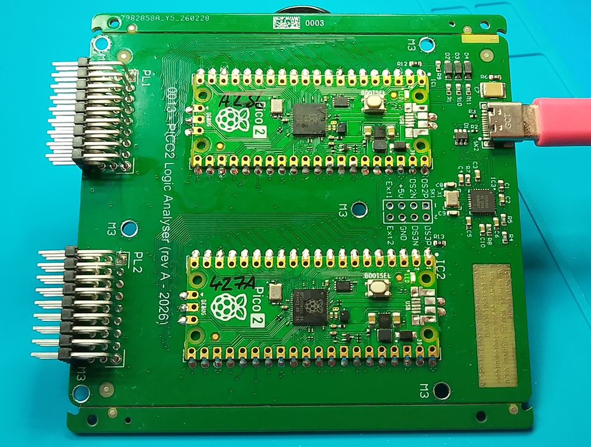
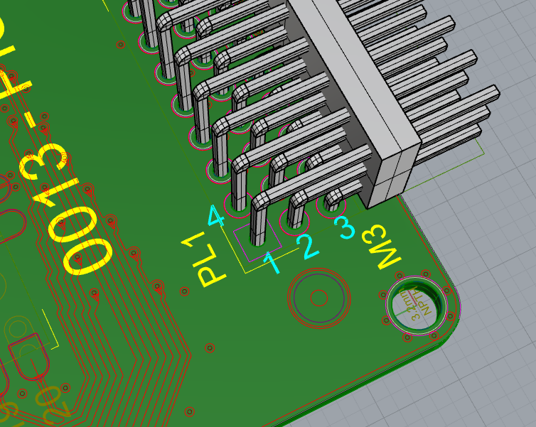
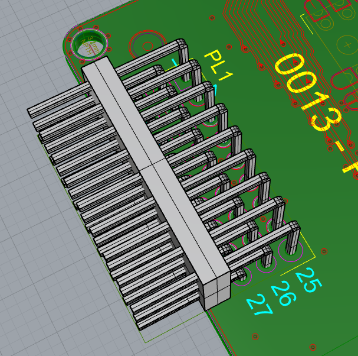

# 0013-Pico2_LA
Logic analyser variant originally by El Gusman  https://github.com/gusmanb

Design errors:\
The M3 mounting holes have their PTH set at 3.0mm by mistake when it should be 3.2mm\
Pin1 on each of the three headers has it's solder mask opening a little too large.  It is possible to short the pin to GND when assembling.\
\

PL1 is the Master header.  PL2 is the 1st Slave header.

|  |  |
| --- | --- |
| When studying the schematic, make note of the pin numbering between the symbol and the footprint of PL1 & PL2. |

There will be a rev B of this design in the near future.\
The new revision will use programmable (with a capacitor) reset supervisor IC, so each of the PICO2 modules will have their nRESET inputs released in sequence upon power connected to the board.\
This will ensure the ttyACMx enumerations are in the sequence we want.\
Then we can assign ttyACM0 as the Master and ttyACM1 as the first Slave and know for certain that ttyACM0 references the Master pins on the signal headers.\
This saves having to use DMESG to look at which PICO2 was given which ttyACM port.

Head over to the Discussions tab if you want to make any comments.
